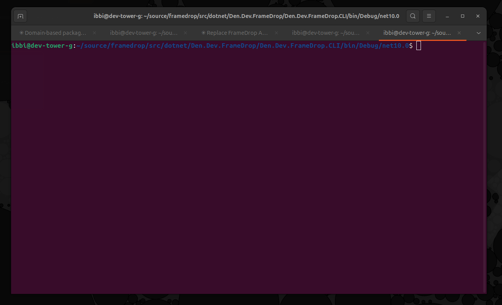

# FrameDrop

A cross-platform library and tool written on top of .NET for downloading Xbox screenshots and video recordings.



> [!WARNING]
> **This library and tool is provided for educational and personal use purposes only.** It comes with no guarantees, implied or otherwise.
>
> By using this library, you acknowledge and agree to the following:
>
> - You interact with Xbox Live APIs **at your own risk**
> - Microsoft and Xbox may ban, suspend, or restrict accounts that use unofficial or unsanctioned APIs and projects (such as this library)
> - I bear **no responsibility** for any account bans, restrictions, suspensions, or other consequences that may result from using this library
> - You accept **full responsibility** for how you choose to use this library and any actions taken with it

## Getting started

The **CLI** is the primary way to use FrameDrop — it handles authentication, listing, and bulk downloading of your Xbox captures in one tool.

## Authentication note

FrameDrop uses the Entra ID client application ID for the **Xbox App for Windows** (`000000004424da1f`). The mediahub APIs that serve screenshots and game clips require permissions that are not granted to third-party registered applications, so we reuse the first-party Xbox App identity.

When you sign in, the browser will redirect to `https://login.live.com/oauth20_desktop.srf?code=<CODE>&...`. Because this is a desktop redirect URI, the page will likely show an error or go blank — that's expected. To grab the authorization code:

1. Open your browser's developer tools (**F12**) before signing in.
2. Switch to the **Network** tab.
3. After signing in, look for the request to `oauth20_desktop.srf`.
4. Copy the `code` query parameter from that URL and paste it back into FrameDrop.

## Prerequisites

- [.NET 10 SDK](https://dotnet.microsoft.com/download/dotnet/10.0) or later

## Build

```bash
cd src/dotnet/Den.Dev.FrameDrop
dotnet build
```

## Usage

Run from the build output directory:

```bash
cd src/dotnet/Den.Dev.FrameDrop/Den.Dev.FrameDrop.CLI/bin/Debug/net10.0
./framedrop <command>
```

Or with `dotnet run`:

```bash
cd src/dotnet/Den.Dev.FrameDrop
dotnet run --project Den.Dev.FrameDrop.CLI -- <command>
```

## Commands

### `framedrop auth login`

Starts the SISU authentication flow to connect your Xbox Live account.

1. FrameDrop attempts to restore a previous session from cached tokens.
2. If no valid session exists, it generates an authentication URL.
3. Open the URL in your browser and sign in with your Microsoft account.
4. After signing in, you'll be redirected to a URL containing a `code` parameter. Copy that code.
5. Paste the code back into the CLI to complete authentication.

```bash
framedrop auth login
```

Use `--verbose` to see HTTP request/response details during login:

```bash
framedrop auth login --verbose
```

### `framedrop auth status`

Displays your current authentication state, including gamertag, XUID, and token expiration.

```bash
framedrop auth status
```

### `framedrop auth logout`

Clears all stored authentication tokens.

```bash
framedrop auth logout
```

### `framedrop list`

Lists all Xbox captures (screenshots and videos) in your cloud storage. Fetches all pages from both the screenshots and game clips APIs, then displays them in a table sorted by upload date (newest first).

```bash
framedrop list
```

The table shows:

| Column | Description |
|---|---|
| **Type** | `Screenshot` or `Video` |
| **Title** | Game the capture was taken in |
| **Uploaded** | Upload date |
| **Expires** | Expiration date, color-coded by urgency |
| **Time Left** | Countdown to expiration: green (>7d), yellow (1-7d), red (<1d), or `EXPIRED` |
| **Size** | File size |

Use `--verbose` to dump the raw JSON responses from the Xbox Live API (useful for debugging field names and response structure):

```bash
framedrop list --verbose
```

### `framedrop download`

Downloads captures from Xbox cloud storage to your local machine.

```bash
framedrop download [options]
```

**Options:**

| Option | Default | Description |
|---|---|---|
| `--type` | `all` | Type of captures: `screenshots`, `videos`, or `all` |
| `--output` | `./captures` | Output directory for downloaded files |
| `--count` | `-1` | Maximum number of captures to download (`-1` for all) |
| `--parallel` | `3` | Maximum number of concurrent downloads |

**Behavior:**

- Fetches all available captures across all pages (using continuation tokens for pagination).
- Pre-scans the output directory before downloading. Files that already exist on disk with the correct file size are skipped automatically — re-running the command is safe and only downloads new or incomplete captures.
- Shows a live progress display with per-file progress bars (title, progress, percentage, downloaded bytes, transfer speed) for active downloads. Completed files disappear from the display.
- An overall status line tracks total progress: count completed, bytes downloaded vs total, and any failures.
- Prints a final summary with downloaded count/size, already-on-disk count, and failure count.

**Examples:**

Download all captures:

```bash
framedrop download
```

Download only videos to a specific directory with 5 concurrent downloads:

```bash
framedrop download --type videos --output ~/xbox-clips --parallel 5
```

Download only screenshots:

```bash
framedrop download --type screenshots
```

## Token Storage

Authentication tokens are encrypted at rest and stored locally:

- **Windows:** `%LOCALAPPDATA%\Den.Dev\FrameDrop\tokens.bin`
- **Linux:** `~/.local/share/Den.Dev/FrameDrop/tokens.bin`

Tokens are encrypted using AES-256-GCM with a PBKDF2-SHA256 derived key (600,000 iterations). The key is bound to the current machine and user (`MachineName + UserName`). If the token file is corrupted or cannot be decrypted, it is automatically deleted and you will need to re-authenticate.
